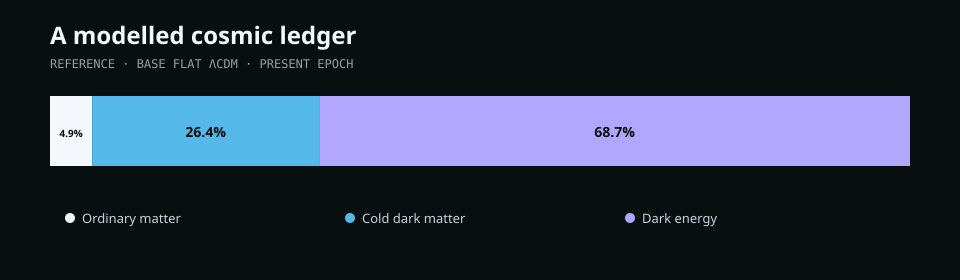
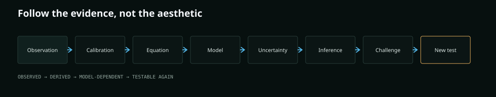
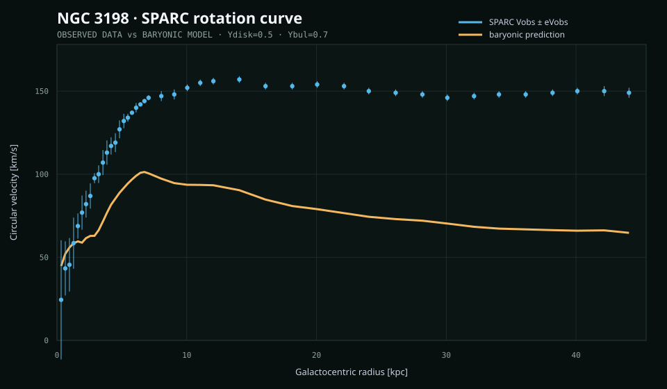
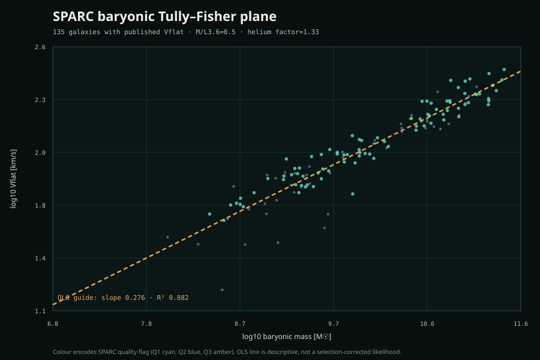
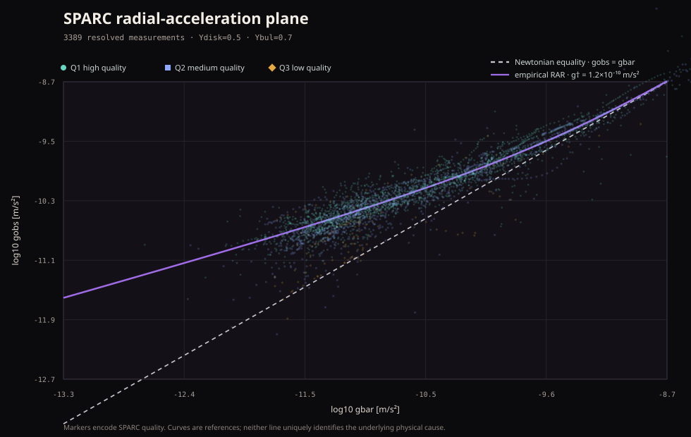
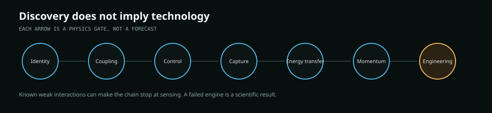

# Dark Matter Evidence Lab

**An open computational laboratory for following the evidence for unseen gravitation from galaxy rotation curves to lensing, cosmology and particle searches - while keeping observation, inference and speculation separate.**

> We can measure gravitational effects that ordinary baryons do not explain by themselves under the standard framework.  
> We can test models and constrain candidate properties.  
> We still do not know the microscopic identity of dark matter.

Dark Matter Evidence Lab is a research-and-teaching project by **Biswajit Jana**. It combines published astronomical data, explicit equations, statistical inference, provenance, tests and interactive visualisation. A visitor should be able to move backwards from a conclusion to the data and assumptions that produced it.

Research contract: [RESEARCH_QUALITY.md](RESEARCH_QUALITY.md)  
Open questions: [OPEN_PROBLEMS.md](OPEN_PROBLEMS.md)  
Release history: [CHANGELOG.md](CHANGELOG.md)

## The question

The project began from a simple question:

**If the matter that emits light does not account for all measured gravitational behaviour, how far can a transparent computational experiment follow the evidence before it reaches assumptions and unknown physics?**

It does not claim that a dark-matter particle has been detected or that one halo family is uniquely true. Instead it exposes the chain:

Observation -> calibration -> equation -> model -> uncertainty -> inference -> competing explanation -> new measurement.

## What are dark matter and dark energy?

They are not the same thing.

- **Ordinary baryonic matter** is the atoms, plasma, gas, dust, stars and compact baryonic objects that participate in familiar electromagnetic physics.
- **Dark matter** is the additional gravitating component inferred in the standard cosmological framework from independent observations including dynamics, lensing, the CMB and structure formation. Its microscopic identity is unknown.
- **Dark energy** is the component or phenomenon used to describe late-time accelerated expansion. The reference model uses a cosmological constant, while evolving equations of state remain an active research question.

The cosmic-budget graphic above is a **model-labelled reference**, not three substances directly weighed in a laboratory. The live site now includes a dedicated **Cosmic Inventory Mathematics** page that exposes the Planck-style physical-density inputs, the conversion \(\omega_i=\Omega_i h^2\), flat-universe closure arithmetic, and primary-source links behind the displayed percentages.

## What is inside the lab?

The current release includes:

- the complete public **175-galaxy SPARC sample** with **3,391 resolved measurements**;
- sign-preserving gas, stellar-disc and bulge mass decomposition;
- pseudo-isothermal, NFW and Burkert halo models;
- weighted likelihood, chi-squared, reduced chi-squared, AIC, BIC and residual diagnostics;
- explicit distance and inclination sensitivity experiments;
- prior-predictive checks, adaptive Metropolis posterior sampling, split-R-hat, effective sample size, trace and autocorrelation diagnostics;
- posterior-predictive intervals and downloadable samples;
- linked BTFR and radial-acceleration population views with quality, morphology, inclination and resolved-point filtering;
- baryons-only, empirical-RAR and MOND-like phenomenological comparison tools;
- quantitative lensing geometry and colliding-cluster evidence;
- a CPL dark-energy background model with H(z), comoving distance and BAO-style distance coordinates;
- a dated dark-matter candidate / experiment atlas;
- a scale explorer from subnuclear physics to the cosmic web;
- an extra-dimension hypothesis explainer that explicitly states extra dimensions are **not required** for electromagnetic darkness;
- a conservation-law futures laboratory for sensing, capture, energy and propulsion thought experiments;
- a typed evidence graph, educator/research views, shareable analysis links and machine-readable state export.

## A representative galaxy

**Figure: NGC 3198 observations versus the baryonic prediction.** Blue circular markers and vertical error bars are the published SPARC circular velocities and quoted random uncertainties; the warm continuous line is the baryonic prediction under the displayed stellar mass-to-light assumptions. It is a reproducible illustration of a mass discrepancy under those assumptions, **not** a direct image or particle detection of dark matter.

The galaxy workbench lets the visitor build this reasoning in stages: observed velocities; gas; stellar disc; bulge where present; total baryonic prediction; discrepancy; selected halo model; residuals; posterior distributions; and posterior-predictive checks.

## Core equations

At radius r, the browser uses SPARC's sign-preserving baryonic convention:

$
v_{\rm bar}^2 =
\operatorname{sign}(V_{\rm gas})V_{\rm gas}^2 +
\Upsilon_{\rm disk}\operatorname{sign}(V_{\rm disk})V_{\rm disk}^2 +
\Upsilon_{\rm bul}\operatorname{sign}(V_{\rm bul})V_{\rm bul}^2 .
$

The model is

$
v_{\rm model}^2 = v_{\rm bar}^2 + v_{\rm halo}^2.
$

Implemented halo families:

    pISO:    v² = v∞² [1 - (rc/r) atan(r/rc)]

    NFW:     v² = vs² [ln(1+x) - x/(1+x)] / x
             x = r/rs

    Burkert: v² = vs² {ln[(1+x)²(1+x²)] - 2 atan(x)} / x
             x = r/r0

The default weighted likelihood assumes independent Gaussian quoted random errors:

$
\chi^2 = \sum_i \left[\frac{V_{{\rm obs},i}-V_{{\rm model},i}}{\sigma_i}\right]^2,
\qquad
\ln L = -\frac{1}{2}\chi^2 + {\rm constant}.
$

That independence assumption is part of the result. It does not represent a complete covariance model.

## Nuisance parameters and Bayesian workspace

Distance and inclination can be varied as explicit sensitivity parameters. They are currently **held fixed during an individual posterior run**, not marginalised as sampled nuisance dimensions.

The browser sampler exposes prior bounds and deterministic seeds. It reports posterior medians and 16th/84th percentiles, split-R-hat, an autocorrelation-based effective sample-size estimate, acceptance rates, **four-chain Monte Carlo traces**, autocorrelation functions, a covariance view and posterior-predictive intervals. Phase C is intentionally compact so the Monte Carlo diagnostics remain visible immediately beneath the posterior plot rather than being separated by large empty panels.

A converged chain does not establish that a physical model is true.

## Galaxies as a population

The population laboratory uses one normalized catalogue and supports filters for galaxy name, quality flag, surface-brightness or gas-rich subsets, morphology, minimum inclination and minimum number of resolved points.

The BTFR illustration uses the explicit working assumption:

$
M_{\rm bar}=0.5\,L_{3.6}+1.33\,M_{\rm HI}.
$

SPARC is broad but is **not a volume-limited statistically complete survey**, so the active selection is always part of the interpretation.

**Population figure — BTFR.** The conventional orientation is now used: **log Vflat on the horizontal axis and log baryonic mass on the vertical axis**. Circle/square/diamond markers encode SPARC quality Q1/Q2/Q3, and the amber dashed line is a descriptive OLS guide. The plotted subset contains the 135 catalogue galaxies with a positive published flat velocity; the fit is not a selection-corrected population likelihood.

**Population figure — radial acceleration.** The 3,389 resolved points use the documented stellar mass-to-light assumptions. Marker shape/colour again encodes SPARC quality; the **grey dashed line** is Newtonian equality \(g_{\rm obs}=g_{\rm bar}\), while the **violet curve** is the empirical RAR reference with \(g_\dagger=1.2\times10^{-10}\,{\rm m\,s^{-2}}\). These curves are comparison references, not claims that one mechanism has been uniquely identified.

### Figure legend and reading guide

| Visual element | Meaning |
|---|---|
| Blue point + error bar in the NGC 3198 figure | Published SPARC circular velocity + quoted random uncertainty |
| Warm continuous curve | Baryonic prediction for the stated mass-to-light assumptions |
| Circle / square / diamond in population figures | SPARC quality Q1 / Q2 / Q3 |
| Amber dashed BTFR line | Descriptive OLS guide in log Mbar versus log Vflat |
| Grey dashed RAR line | Newtonian equality, gobs = gbar |
| Violet RAR curve | Empirical radial-acceleration reference, g† = 1.2×10⁻¹⁰ m s⁻² |

## Challenge the model

The project does not hard-code "dark matter wins" into the interface. A selected galaxy can be compared against baryons-only behaviour, the selected halo family and phenomenological acceleration mappings. It shows assumptions, residuals and fit diagnostics rather than declaring a winner.

## Gravitational lensing and colliding clusters

The lensing laboratory implements angular-diameter geometry, critical surface density and an SIS scale:

$
\Sigma_{\rm crit} = \frac{c^2}{4\pi G}\frac{D_s}{D_lD_{ls}}.
$

The cluster catalogue includes the Bullet Cluster, MACS J0025.4-1222 and Abell 520 as a systematics/disagreement case. The Bullet Cluster record preserves both the classic separation of dominant X-ray gas from lensing-inferred total mass and the higher-resolution 2025 JWST reconstruction showing richer substructure.

The rendered layer map is an **educational reconstruction**. It is not a fresh inversion of a published shear catalogue.

## Cosmology and dark energy

The cosmology module supports a CPL equation of state:

$
w(a)=w_0+w_a(1-a)
$

and computes component fractions, H(z), comoving distance, and educational BAO-style coordinates D_M/r_d and D_H/r_d. These are **background-model responses**, not a Planck or DESI likelihood and not a substitute for CLASS/CAMB.

The interface keeps a Planck-like flat-Lambda-CDM reference while noting the July 2026 DESI DR2 full-shape Ly-alpha result: the newest central value moved toward the reference Lambda-CDM prediction, so evolving dark energy remains an active model-comparison question rather than a settled discovery.

## Candidate and experiment atlas

Different dark-matter hypotheses occupy different parameter spaces and require different instruments. The atlas does **not** compress every candidate into one misleading universal mass-versus-cross-section figure.

Experiment rows are timestamped and classified as search, limit, survey or anomaly. The September 2026 LZ high-energy recoil candidate is recorded as a **background-only tension / anomaly, not a dark-matter discovery**.

## Where could dark matter be?

Under standard Galactic halo models a local dark-matter population is expected to pass through the Solar neighbourhood and Earth. "Dark matter is everywhere" is an oversimplification: density varies strongly with environment, and cosmological abundance does not imply easy capture or useful local energy density.

## Could dark matter be hidden in another dimension?

No extra spatial dimension is required for a particle to be optically dark. A state living in ordinary 3+1-dimensional spacetime can simply have no useful electromagnetic coupling.

Extra-dimensional, braneworld or Kaluza-Klein scenarios are therefore labelled **hypothesis**, not established explanation.

## Physics-constrained futures

A discovery would not automatically create an engineering material. The project forces a sequence of physical gates:

identity -> coupling -> control -> capture -> confinement -> energy transfer -> directed momentum -> engineering.

For local density rho_chi and relative speed v_chi, the futures module calculates mass flux, kinetic-power flux, momentum flux and an explicitly idealised rest-energy ceiling. A toy target column uses:

$
P_{\rm int}=1-e^{-\sigma N}.
$

That interaction term often makes the engineering scenario collapse: a huge geometric collector can still be almost transparent to a very weakly interacting component. The purpose is to discover **where an idea fails**, not to manufacture a futuristic result.

## Reproducibility

Install and verify:

    npm ci
    npm run verify

Development server:

    npm run dev

Production build:

    npm run build

Regenerate the README figures:

    npm run docs:figures

Refresh the checksum-pinned SPARC catalogue:

    npm run data:refresh

The import pipeline records upstream SPARC checksums and stops on a checksum mismatch.

### Independent Python / SciPy cross-check

A separate least-squares implementation does **not** import the browser JavaScript:

    python -m venv .venv
    pip install -r validation/requirements.txt
    python validation/rotation_scipy.py --write

Its role is cross-language numerical parity. Agreement would not prove the physical model.

## Shareable analyses

The application can copy a URL containing selected galaxy, halo family, fit parameters, distance scale, inclination offset, guided evidence stage and interface mode. Workspace JSON export additionally records the cosmology, lensing, population and futures state plus provenance and software version.

## Repository architecture

~~~mermaid
flowchart TD
  A[SPARC / cluster / cosmology / experiment sources] --> B[Provenance and machine-readable data]
  B --> C[Tested physics modules]
  C --> D[Worker inference and validation]
  D --> E[Scientific visualisation]
  E --> F[Educator / Research interface]
  F --> G[CSV / JSON / SVG / shareable state]
  C --> H[Independent SciPy validation]
  B --> I[Open-problem registry]
  I --> F
~~~

Key paths:

| Path | Role |
|---|---|
| rotationPhysics.js | SPARC decomposition, halo models, likelihood and posterior machinery |
| lensingPhysics.js | distance geometry, critical density and lensing scale |
| cosmologyPhysics.js | background expansion, CPL dark energy and BAO-style distances |
| futuresPhysics.js | local flux, wave/particle scales and engineering upper bounds |
| physicsWorker.js | off-thread galaxy fitting and posterior work |
| data/galaxies.json | complete normalized SPARC catalogue |
| data/open_problems.json | machine-readable research frontier |
| validation/ | independent SciPy numerical cross-check |
| docs/figures/ | reproducible publication figures |
| docs/thesis/ | technical monograph source |
| tests/ | analytic, schema, inference and UI-contract tests |

## What this repository does not claim

- It does not identify the dark-matter particle or field.
- A low chi-squared does not make one halo profile uniquely true.
- The SPARC quoted random uncertainties are not the complete covariance budget.
- Distance and inclination are sensitivity controls, not fully marginalised posterior dimensions.
- The browser MCMC is a transparent research/teaching implementation, not a replacement for a peer-reviewed inference pipeline.
- Cluster maps are explanatory layers, not a fresh raw-shear reconstruction.
- The cosmology explorer is not a Boltzmann solver or collaboration likelihood.
- An experimental anomaly is not a discovery.
- Extra dimensions are not required by the evidence.
- The futures laboratory does not demonstrate practical capture, free energy, antigravity, reactionless propulsion, faster-than-light travel or wormholes.

## Open research frontier

The durable question registry is in [OPEN_PROBLEMS.md](OPEN_PROBLEMS.md) and data/open_problems.json. Each record contains the question, importance, equations, current evidence, competing hypotheses, datasets, discriminating measurement, falsification criteria, degeneracies and status.

The long-term goal is not to preserve a claim that dark matter was solved. It is to preserve enough data, assumptions and tests that a future researcher can replace one assumption with a new measurement and see which conclusions survive.

## Project motivation

This project began because the dark-matter problem has an unusual character: its gravitational evidence appears across many scales, while the entity responsible remains unidentified.

I wanted to build something more useful than a static explanation - a laboratory where the observations, assumptions, equations and uncertainties could be inspected directly. A second question followed naturally: if the microscopic physics is eventually discovered, what additional physical properties would have to exist before that scientific unknown could become a sensing medium, an energy source or a propulsion concept?

The repository therefore treats curiosity as the starting point and falsifiability as the constraint.

## Citation

Use [CITATION.cff](CITATION.cff) for the software citation and cite the original datasets/papers used in any derived analysis.

## Selected references

- Lelli, F., McGaugh, S. S. & Schombert, J. M. (2016), *SPARC: Mass Models for 175 Disk Galaxies with Spitzer Photometry and Accurate Rotation Curves*, AJ 152, 157. DOI: 10.3847/0004-6256/152/6/157.
- de Blok, W. J. G. et al. (2008), *High-Resolution Rotation Curves and Galaxy Mass Models from THINGS*, AJ 136, 2648.
- Navarro, J. F., Frenk, C. S. & White, S. D. M. (1996), *The Structure of Cold Dark Matter Halos*, ApJ 462, 563.
- Burkert, A. (1995), *The Structure of Dark Matter Halos in Dwarf Galaxies*, ApJL 447, L25.
- McGaugh, S. S., Lelli, F. & Schombert, J. M. (2016), *Radial Acceleration Relation in Rotationally Supported Galaxies*, PRL 117, 201101.
- Clowe, D. et al. (2006), *A Direct Empirical Proof of the Existence of Dark Matter*, ApJL 648, L109.
- Cha, S. et al. (2025), *A High-Caliber View of the Bullet Cluster Through JWST Strong and Weak Lensing Analyses*, arXiv:2503.21870.
- Planck Collaboration VI (2020), *Planck 2018 results. VI. Cosmological parameters*, A&A 641, A6.
- DESI Collaboration DR2 publications (2025-2026), BAO and Lyman-alpha full-shape cosmology results.
- Particle Data Group, current dark-matter and cosmology reviews.
- LZ Collaboration, September 2026 high-energy nuclear-recoil search status.

## Licence

MIT for repository code unless a file states otherwise. Observatory images and external datasets retain their original credits/licences; the interface links their sources directly.
